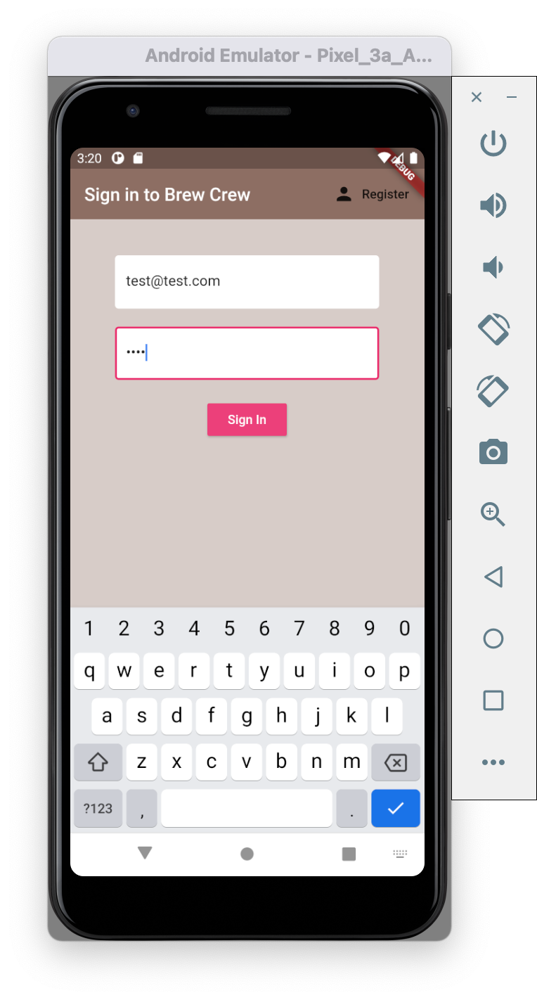
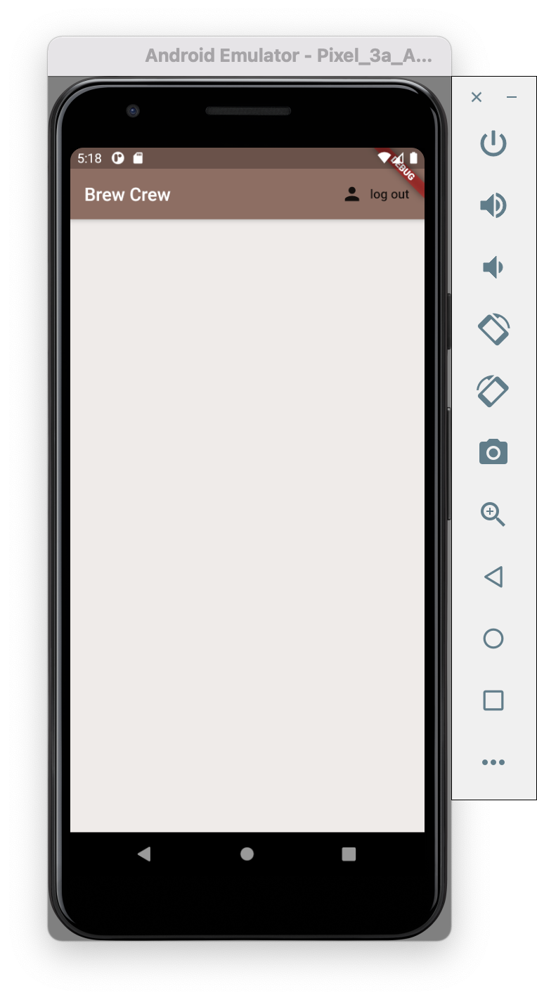
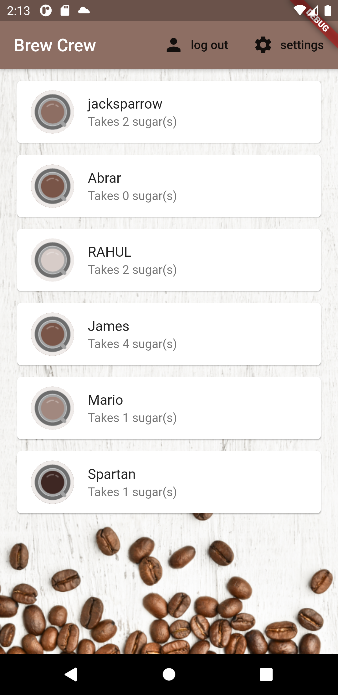
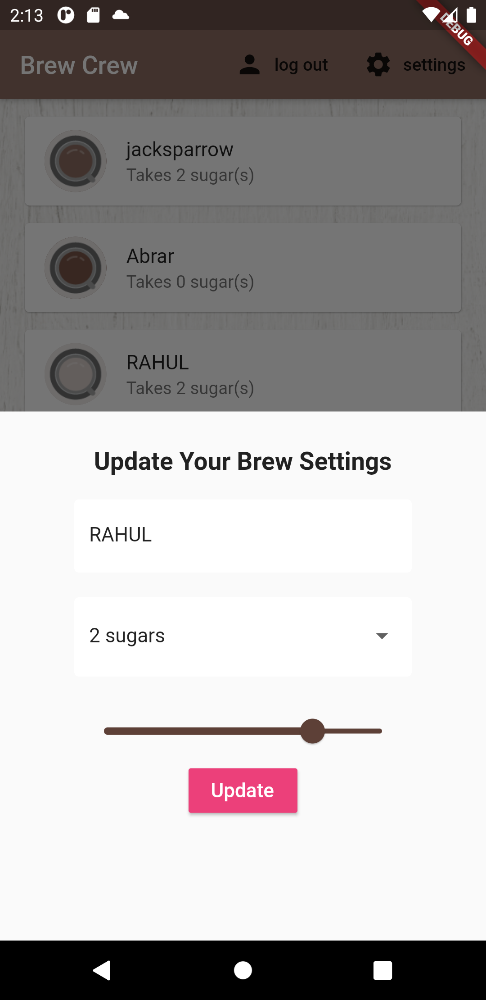
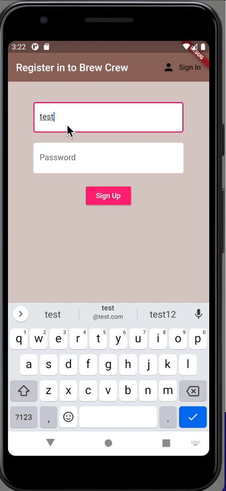
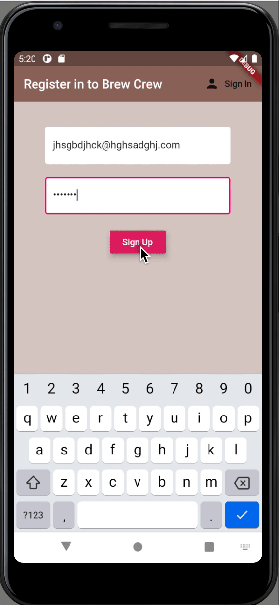

# Learned Firebase Auth & Firestore Database ( login , signup in realtime manipulation with database)

## Download from this link

[Click on this link](https://drive.google.com/file/d/1MXRGpzW5diPkt4LkYq2QTpCcXNsGhg7y/view?usp=sharing)
## Getting Started

This project is a starting point for a Flutter application.

 So far learned :

Saving data to a Firebase database : CHECK
 
Syncing data in realtime.          : CHECK
 
Authenticating users.              : CHECK
 
Monitoring online users            : !CHECK
 
Manipulation of database on large scale : !CHECK

# Screenshots:

### Register

###  Database
.png)
### Sign In

### Logged In

## HOMEPAGE

## EDIT PROFILE

# Some of gifs :

## SIGNUP THEN LOGIN
 

## SIGNIN

## LOADING

